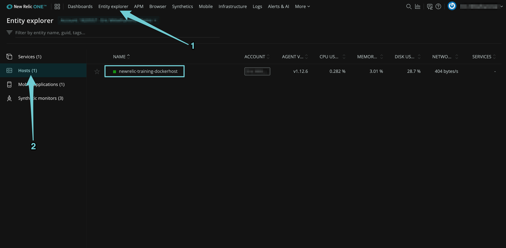
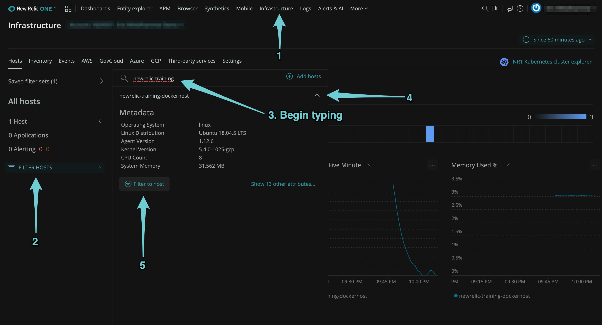
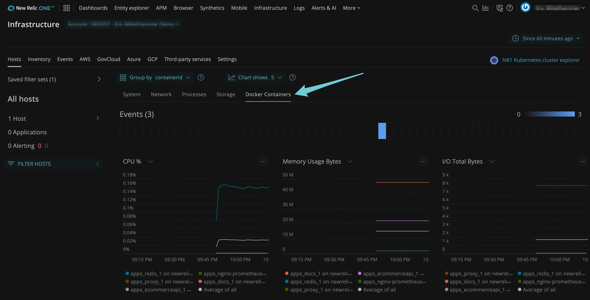
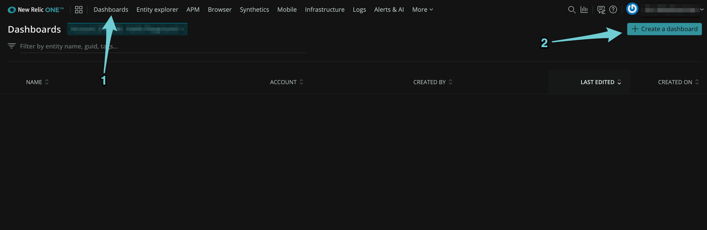

{markdown: ../common/header.md}
# Explanation
In this challenge, we enabled the New Relic Infrastructure agent on a single host.  Now, let's look at the data we're receiving in New Relic One.

## Verify that the host is sending data
In New Relic One, click on "Entity Explorer", and then "Hosts".  Verify that you see a host named `newrelic-training-dockerhost`.

## Explore your data
Let's look at the data we're getting in New Relic One.  Navigate to the Infrastructure UI, and filter the view so we are only seeing the host we just created.

Take a look at the metrics available for the host itself.

Then click on "Docker Containers" in the metrics navigation menu.

Here we can see performance metrics for each of the containers running on our host, including our ecommerce api.  This is a great start, but we can go deeper.  Much deeper, using New Relic's APM agent.

## Create a dashboard
Before starting the next challenge, create a new dashboard in New Relic One.  We'll use this to create charts with all of the data we're going to collect.
