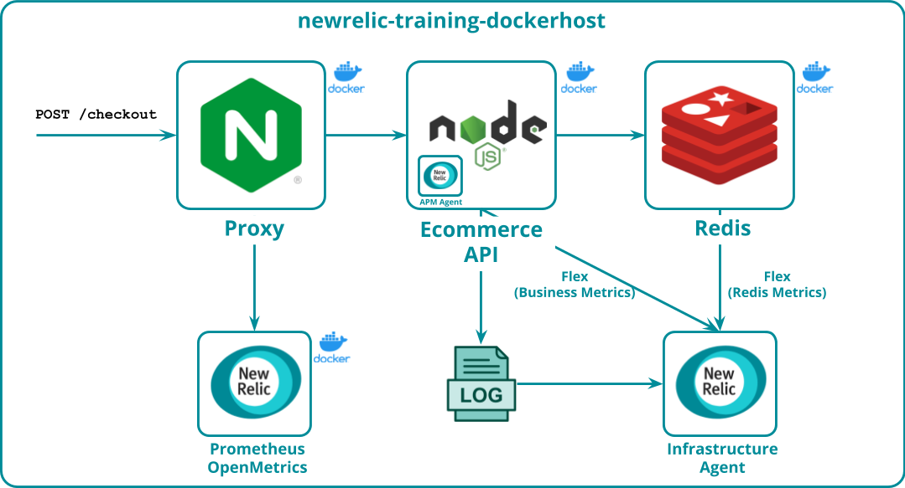

{markdown: ../common/header.md}
# Overview
The age of microservices and DevOps has ushered observability to the forefront of the minds of practitioners.  While the resulting explosion of available telemetry data is generally a Good Thing, it has led to data sprawl and siloed tooling within teams and organizations.  In this hands-on session, you’ll learn how New Relic’s <a href="https://newrelic.com/platform/telemetry-data-platform" target="_blank">Telemetry Data Platform</a> makes it easy to ingest data from anywhere, across all of the M.E.L.T (Metrics, Events, Logs, and Traces) <a href="https://docs.newrelic.com/docs/telemetry-data-platform/ingest-manage-data/understand-data/new-relic-data-types" target="_blank">telemetry data types</a>.

We’ll cover the building blocks of data ingestion, including New Relic’s <a href="https://docs.newrelic.com/docs/integrations/open-source-telemetry-integrations/get-started/introduction-new-relics-open-source-telemetry-integrations" target="_blank">Open Telemetry]</a> capabilities and <a href="https://docs.newrelic.com/docs/integrations/host-integrations/host-integrations-list/flex-integration-tool-build-your-own-integration)" target="_blank">Flex</a> integration builder, and then we’ll visualize the data we’ve collected by querying NRDB, the world’s most powerful telemetry database.

## Environment
The sample application and tools in this track will be be running in Docker containers on a virtual machine that has been provided for you.  You can edit configurations and instrument them in the interactive environment in your web browser.  No need to install anything!

The environment can be descibed by the image below:

There is a node.js application that simulates an ecommerce api.  It uses a redis database to store some internal state.  Requests to the api are routed through an NGINX web server acting as a proxy.  All three are running in Docker containers.

We'll collect data from this environment in the following ways:

- The<a href="https://docs.newrelic.com/docs/infrastructure" target="_blank">New Relic Infrastructure</a> agent is running on the virtual machine.  We can get os-level metrics about the virtual machine and the Docker containers themselves from telemetry data collected by the agent.  But as you'll see, the capabilities of the agent go far beyond collecting metrics from the host it's running on!
- We'll get visibility into the node.js application using the <a href="https://docs.newrelic.com/docs/agents/nodejs-agent" target="_blank">New Relic APM agent for node.js</a>.  In addition to `Transaction` events collected for each request processed by our application, we'll get end-to-end distributed traces and performance metrics.
- We'll use the <a href="https://docs.newrelic.com/docs/logs/enable-log-management-new-relic/enable-log-monitoring-new-relic/enable-log-management-new-relic#infra-agent" target="_blank">New Relic APM agent for node.js</a> from the ecommerce api application.
- The NGNIX proxy exposes key metrics in the Prometheus metrics format.  We'll use <a href="https://docs.newrelic.com/docs/integrations/prometheus-integrations/get-started/send-prometheus-metric-data-new-relic" target="_blank">New Relic's Prometheus OpenMetrics Integration</a> to scrape them and ship them to the Telemetry Data Platform.
- Using <a href="https://docs.newrelic.com/docs/integrations/host-integrations/host-integrations-list/flex-integration-tool-build-your-own-integration" target="_blank">Flex</a>, we'll build custom integrations using a simple yaml configuration file to harvest metrics from Redis, and a from a custom api endpoint.