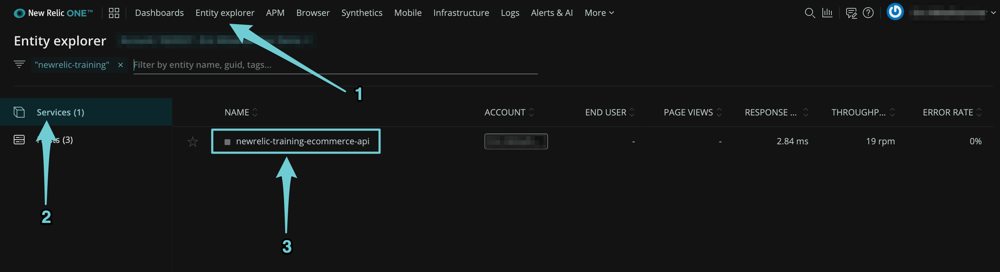
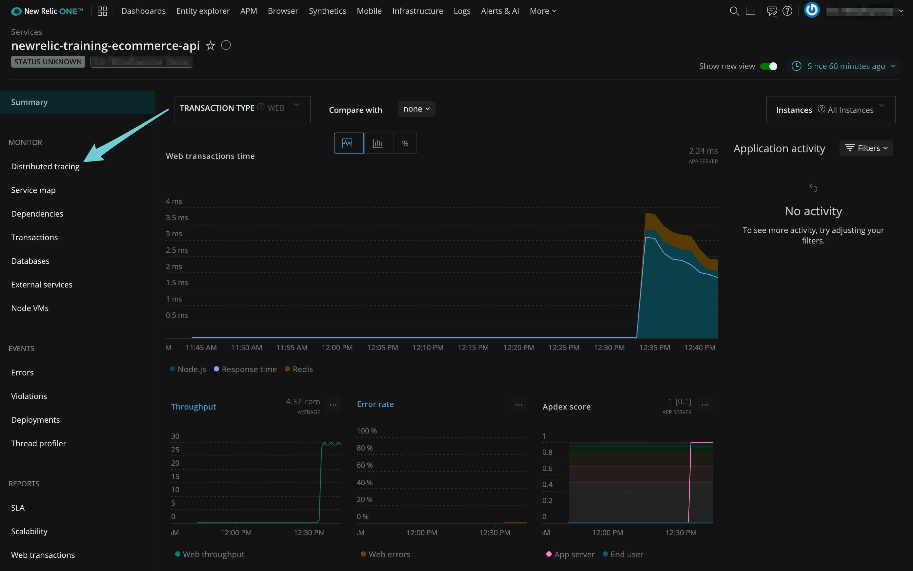
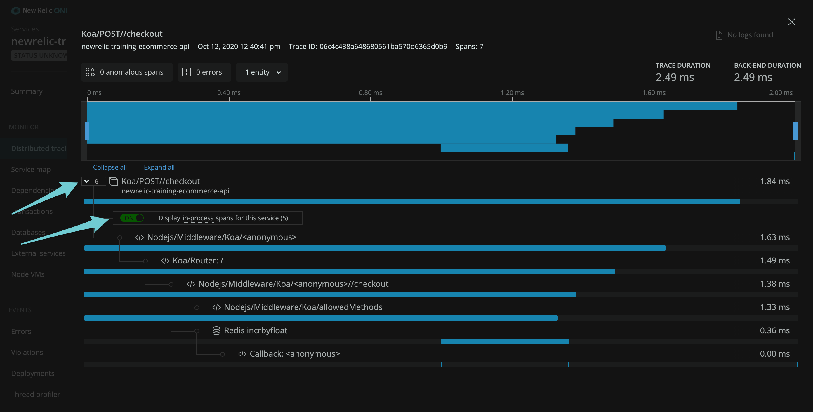
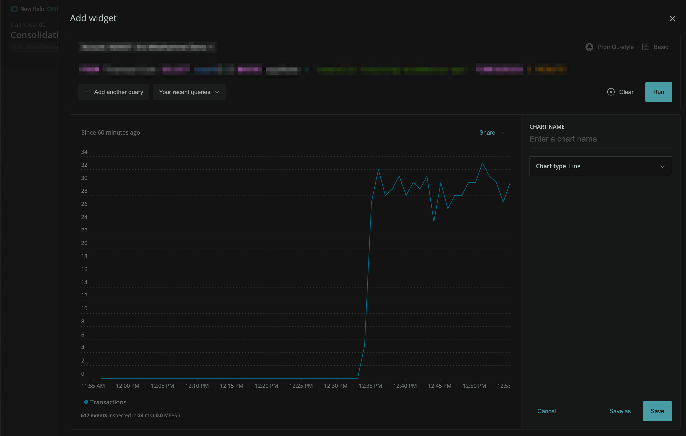

{markdown: ../common/header.md}
# Explanation
New Relic's APM agent collects data from within your applications.  In this challenge, we enabled the APM agent on our node.js ecommerce api application.  In this case, we have also enabled Distributed Tracing to get a more complete view of what is happening inside our application.

Read more about New Relic APM here:
<a href ="https://docs.newrelic.com/docs/apm" target="_blank">New Relic APM</a>

and Distributed Tracing here:
<a href="https://docs.newrelic.com/docs/understand-dependencies/distributed-tracing/get-started/introduction-distributed-tracing" target="_blank">Introduction to Distributed Tracing</a>

## Verify that the application is sending data
In New Relic One, click on "Entity Explorer", and then "Services".  Verify that you see a sevice named `newrelic-training-ecommerce-api`.

Click on your application to see the curated APM view.  This gives you a view to what happeing inside of your application. Take a look at the charts and metrics that are available.

Once you've reviewed the overall performance of the application, click on the the link in the left hand menu named "Distributed Tracing"

You'll see a list of all of the recent traces collect for you application.  Click on one of them to see the trace details, and expand any collapsed spans.  You should see something like this:

## Create a chart displaying application throughput
Navigate back to the dashboard you created in the previous challenge and click on an empty slot to add a chart.  You will be presented with the query builder.  You can use <a href="https://docs.newrelic.com/docs/query-your-data/nrql-new-relic-query-language/get-started/introduction-nrql-new-relics-query-language" target="_blank">NRQL, New Relic's query language</a> to build the chart, or you can use "Basic" mode by clicking the icon on the left of the screen, which will guide you through creating the chart.

We want to create a chart that shows throughput, or the number of Transactions we are processing, per minute, for our ecommerce api application.  How would you query that?

Your chart should looks something like this:

  
Spoiler: click here to view the NRQL query

  <pre>FROM Transaction SELECT count(*) WHERE appName = 'newrelic-training-ecommerce-api' TIMESERIES 1 MINUTE</pre>

Once you're sure that you're querying the correct data, Name your chart, save it to your dashboard, and move on to the next challenge.
