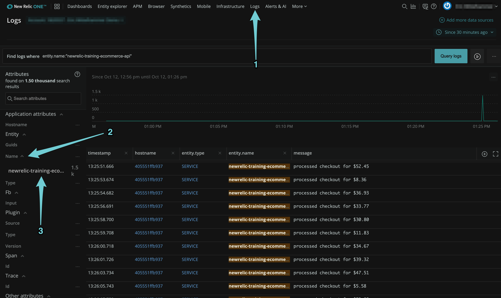
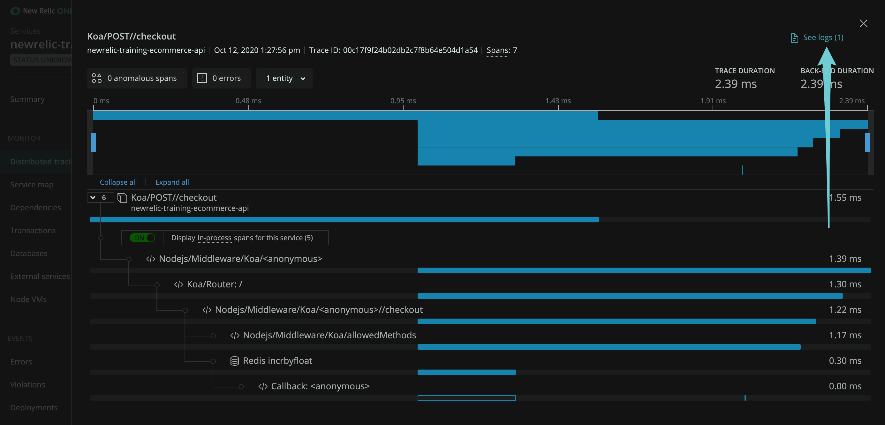

{markdown: ../common/header.md}
# Explanation
We added a configuration file to the New Relic Infrastructure agent to tell it to consume logs from the ecommerce api application.

More information about how we can collect logs with the New Relic Infrastructure agent can be found <a href="https://docs.newrelic.com/docs/logs/enable-log-management-new-relic/enable-log-monitoring-new-relic/forward-your-logs-using-infrastructure-agent" target="_blank">here</a>.

To view your log messages, navigate to the logging part of the UI in New Relic One.  If you are consuming a high volume of logs in your account, it may be beneficial to filter the log messages to only show messages from our application.  To do that, find the application attribute "Name" on the left-hand side of the screen, and click on the name of our application: `newrelic-training-ecommerce-api`

Feel free to use the search bar at the top of the screen to explore, search, and filter logs however you might in a real application.

Now navigate back to the Distributed Traces for the application and open a trace.  Notice that there is a new UI element available to us at the top right.  "See Logs (1)".

Click the link and you can see the log message in context, where it was generated during that individual trace.

It seems like we've done a great job of instrumenting our ecommerce api application, but remember that there are some other components in our stack that we need some visibility into.  Proceed to the next challenge to find out how to do it.

