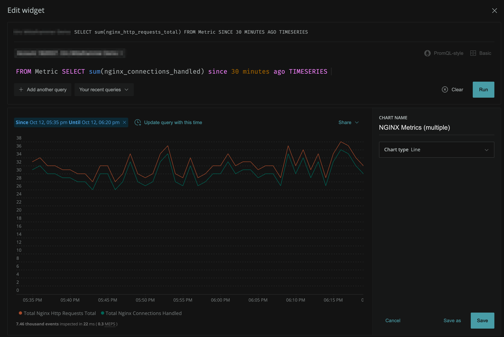

{markdown: ../common/header.md}
# Explanation
The metrics that are being scraped and sent to New Relic are what are known as <a href="https://docs.newrelic.com/docs/telemetry-data-platform/ingest-manage-data/understand-data/new-relic-data-types#dimensional-metrics" target="_blank">Dimensional Metrics</a>.  That is, a numerical value or measurement that has metadata or attributes attached to it.  In New Relic One, they can be queried via the `Metric` event type.

Since the the `Metric` event can have many attributes attached to it, it may be easier to use New Relic One's Data Explorer to browse and find what we are looking for.

The Data Explorer can be launched via the global navigation:

## Create a Chart Using Dimensional Metrics
Let's make a chart that displays the number of requests that NGINX is handling over time.  After launching the Data Explorer, make sure you are browsing for **Metrics** as opposed to **Events**.

Search or scroll to the metric named `nginx_http_requests_total`, and choose to aggregate it by `sum`.  A visualization will automatically be created for you, and you can see what the underlying NRQL query is.

Finally, Use the "three dots" icon to add the chart to your dashboard:

After adding the chart to the dashboard, you'll notice that, predictably, the number of requests that NGINX is handling closely resembles the throughput that our application is handling:

## Compare Two Dimensional Metrics in the Same Chart
Let's see, though, if we can't get some more useful data from our NGINX Metrics.  Let's compare the number of requests that are handled to the number of connections that are handled (or any other metric that you may find interesting).

Click on the three dots in the corner of the chart you just created and select "Edit", beneath the NRQL query used to make the timeries on the chart, you'll see a button to "Add another query". Click it.  Given what you know about the first timeseries, could you construct the query for a timeseries that displays the number of handled connections?

  
Spoiler: click here to see what that might look like

   

Once you've added the second time series, save your chart and proceed to the next challenge.