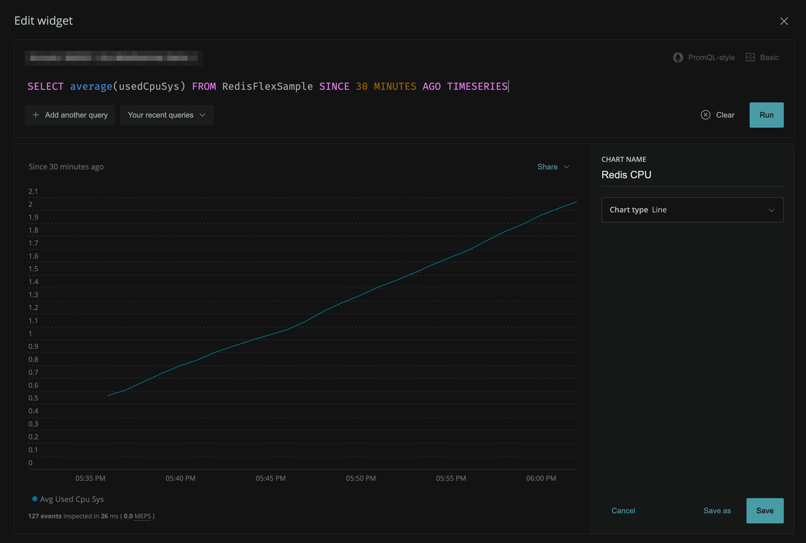
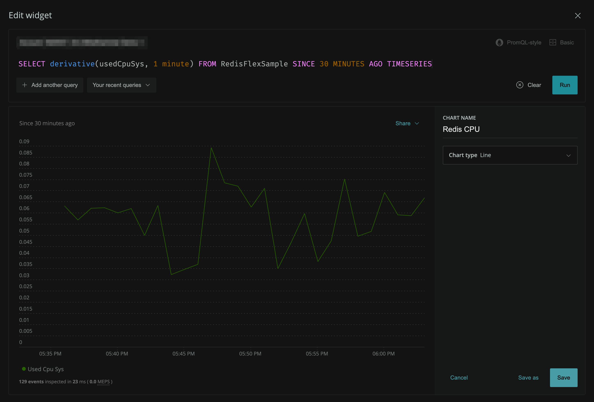

{markdown: ../common/header.md}
# Explanation
Now that we've told Flex how to ask Redis for metrics, let's see how they appear in New Relic One.

Launch the Data Explorer again, this time browsing **Events**.  Search for or scroll to the `RedisFlexSample` event and select it.  Inspect which values you can plot, and which dimensions you can group or filter by.  You'll notice they are all of the same fields that were returned by the `INFO` command we executed previously.

## Create a Chart Using Data from a Flex Sample Event
Events that are created by Flex can be analyzed just like any other event on the platform.

Let's make a chart displaying the amount of CPU usage that our Redis server is consuming.  We can do this using the `usedCpuSys` attribute of the `RedisFlexSample` event.

Create a timeseries chart that shows the average amount of cpu usage Redis is consuming.  You'll probably want to use the <a href="https://docs.newrelic.com/docs/query-your-data/nrql-new-relic-query-language/get-started/nrql-syntax-clauses-functions#func-average" target="_blank">average</a> aggregator function here.

Does your chart look like this?

That doesn't look correct.  At least, we hope not.  It's increasing linearly, and constantly.  What could it be?

The Redis `INFO` command has no way of knowing the time range for which you are requesting metrics.  You could run the command every second, or every hour, or any time in between.  Which value should it return?  It solves this by returning the *sum* of the total CPU usage since the process was started, leaving it to us, the consumer of the data, to deconstruct it.

This is why our value is constantly increasing. Luckily NRQL has a function named <a href="https://docs.newrelic.com/docs/query-your-data/nrql-new-relic-query-language/get-started/nrql-syntax-clauses-functions#derivative" target="_blank">derivative</a> (remember your intro-level Calculus course????) that is designed to solve exactly this problem.  By applying the derivative to the timeseries, we will then see the approximate value at each point in time.

Adjust your query, save the chart, and proceed to the next challenge.
