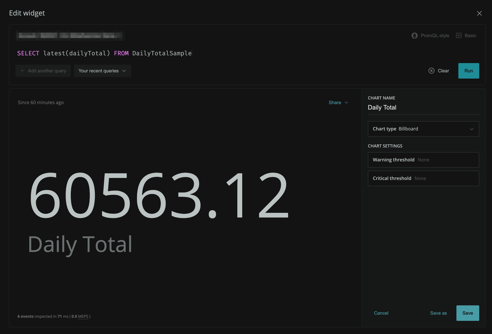
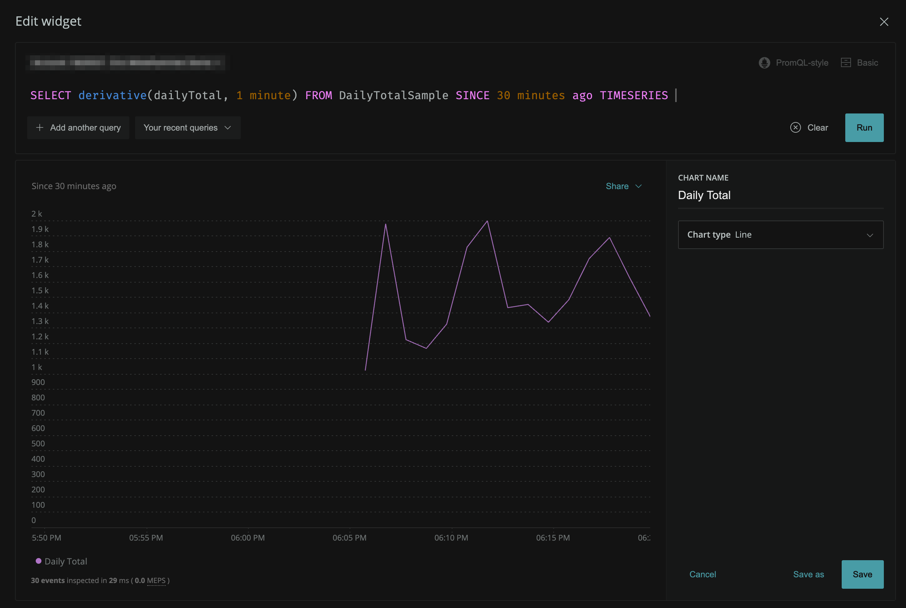
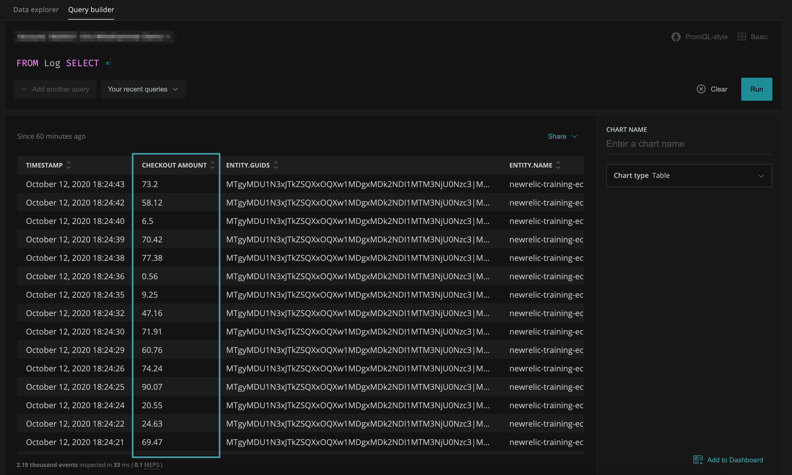
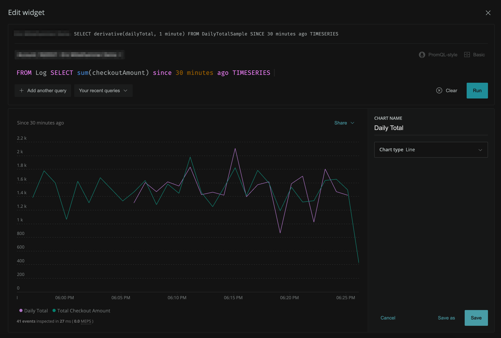

{markdown: ../common/header.md}
# Explanation
In this challenge, we had Flex collect arbitrary data from our own api that shows the current running total of checkouts in our system, using a custom event named `DailyTotalSample`.

_Note: you could easily attach the checkout amount to each `Transaction` as a <a href="https://docs.newrelic.com/docs/using-new-relic/data/customize-data/collect-custom-attributes" target="_blank">custom attribute</a> within your application.  But for the purpose of the excercise here, we're demonstrating how you can leverage data coming from systems that you may not have that kind of access to._

## Creating a Billboard Chart with a singular value
Let's proudly display our total checkout amount so we know how our business is doing whenever when we look at our New Relic dashboards.

In this case, we are not so much interested in timeseries values as we are in the most recent value. The function that does that for us is called <a href="https://docs.newrelic.com/docs/query-your-data/nrql-new-relic-query-language/get-started/nrql-syntax-clauses-functions#dl-latestattribute" target="_blank">latest</a>.

How would you do that?

  
Spoiler: click here to see how to query a single value

   

But, what if we _did_ want to see how we were doing over the course of time?  Could we use our `DailyTotalSample` for that?

  
Spoiler: click here to see how to approximate our checkouts over time

  Yep.  Derivative again:
   

## Bonus: Verify the Approximate Value Using Logs
New Relic can accept structured log messages with any arbitrary key/value pairs, in addition to the fulltext `message` field.  These log messages can then be queried and analyzed alongside all of the other data you've collected and sent to the platform.  All log messages are collected under an event named `Log`.

Let's inspect the log messages from our ecommerce api application by selecting all fields from the Log event.

You can see that there is a field named `checkoutAmount`. Instead of having a sum total of our checkouts, we have the individual amount for every transaction that we've logged.  For fun, let's use that to compare to the amount we are approximating with `derivative` on `DailyTotalSample`.

Edit your chart, adding another query that shows the average `checkoutAmount` calculated uisng `Log` events.

  
Spoiler: click here to see the comparison

  

  Not bad!  You can see from the additional query of _actual_ values from the logs that using `derivative` to approximates it pretty closely.

You've now completed the track, and should have a good understanding various ways to ingest data into New Relic's Telemetry Data Platform.

Use this knowledge to consolidate all your data into the worlds most powerful telemetry database!